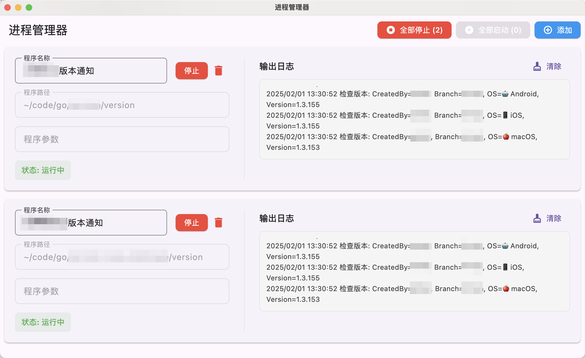

# 进程管理器

一个使用 Flutter 开发的跨平台进程管理工具，支持 Windows 和 macOS。

## 功能特点

- 管理多个进程的启动和停止
- 实时查看进程输出日志
- 自动保存进程配置
- 支持进程参数配置
- 优雅的退出处理

## 界面预览



## 开发环境

- Flutter 3.0.0 或更高版本
- Dart 3.0.0 或更高版本
- Windows 10+ / macOS 10.14+

## 构建运行

1. 确保已安装 Flutter 开发环境
2. 克隆项目到本地
3. 运行以下命令：

```shell
flutter pub get
flutter run
```

### Mac上运行
```shell
sudo spctl --master-disable
```
